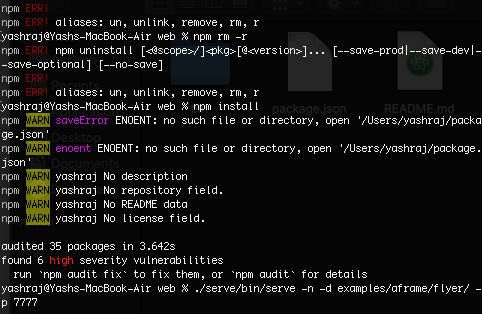

# WebXR 8i holograms  
## 8i holograms using 8th wall  
Developing Virtual Reality based solutions in areas like:
(ii) VR/XR solution for making a completely VR human with the help of 8i. (.hvrs holograms) XR stands for Extended reality which is slightly more enhanced than usual Virtual reality. It is one of the two choices of assignment 2 you have.  
# Jump In
## What you will need:  
1. Start of with this [very short video](https://youtu.be/aO3TAke7_MI) to tell you about 8i.  
2. To have a feel of what you are gonna be doing head to [8th wall holograms](https://8th.io/mrcs) on your mobile phones.
3. To know the steps follow along [Medium](https://medium.com/8th-wall/human-holograms-can-now-live-on-the-web-with-our-latest-integration-8i-4e16295b06df). 
4. Read some docs at [8th wall documentation](https://www.8thwall.com/docs/web/). Just as much as you can.  
Note: You'll need AR supported phones for each of the assignments.
  
# What exactly are we gonna make?
This assignment is going to be a fairly easy one... Cause the ideas of 8i integration with 8th wall is still not so mature.. What we will be making is a website that has a .hvrs or .8i format hologram... What you have made by following along the Medium website in step 3...
Then you'll then have to customise it a bit. Also keep the hologram files in the local and not just use the default one, I'll provide some sample hvrs so you can change them.
  
## Customization
Make your own changes by changing the .hvrs and if you want to, you can also change it's floor_logo_cropped.jpg into something meaningful. Don't Forget the aim is to make a VR human with the help of 8i, also the default holograms that appears is uploaded in cloudfront and is not by you, and services like cloudfront have pricing so it's better you keep them in local and provide those links... Just a sample to show you one possible customisation is [here](https://vimeo.com/user115354946/review/417906175/fd32a85c2d) ... 
The score for completion of the whole task is 100 points with 20 points in customization to something meaningful, 20 points to keeping the .hvrs in your local... Rest 60 points in achieving the default hologram following step 3 above.
  
## Solving Errors
See that you are in serve folder only when you run ```npm install``` in your terminal. Still sometimes this bug appears
  

  
This is npm installation error which tells you to audit fix and says found 6(or more) high severity vulnerabilities...
Fix it by typing ```npm cache clean --force``` so if any log of files prevent installing npm, or there is unexpected end of JSON.. it can be fixed.. Also don't forget to ```cd ..``` to go back to web folder before starting the local server..
  
## Wrapping up


